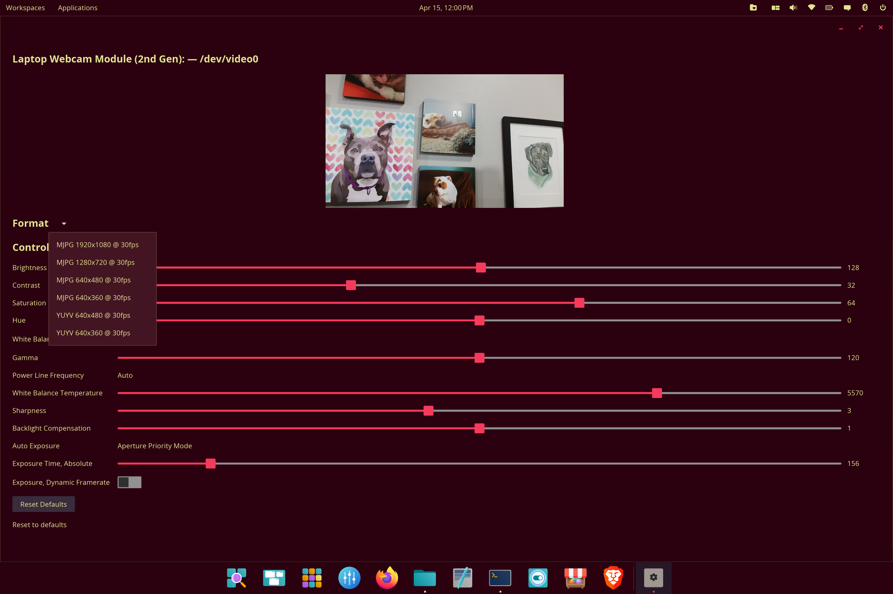

# cosmic-camera-controls

Native [COSMIC](https://github.com/pop-os/cosmic-epoch) desktop app for webcam configuration via V4L2.



## Features

- **Live camera preview** — real-time viewfinder with MJPEG and YUYV decode
- **Dynamic V4L2 control enumeration** — UI auto-generated from hardware-reported controls (brightness, contrast, saturation, hue, gamma, sharpness, white balance, exposure, focus, backlight compensation, power line frequency, pan/tilt/zoom, flip/mirror — whatever the camera supports)
- **Resolution & framerate selection** — enumerate and switch supported format/size/fps combinations with live preview update
- **Per-camera profile persistence** — settings saved to TOML config, keyed by USB VID:PID:serial
- **Auto-save on every change** — no manual save step, survives reboot
- **Auto-restore on launch** — saved controls reapplied when a known camera is detected
- **Smart control ordering** — auto mode toggles applied before dependent manual controls
- **Multi-camera support** — device selector dropdown when multiple capture devices present
- **Hot-plug detection** — cameras detected/removed automatically while the app is running

No audio. No daemon. No background service.

## Build

### Arch / CachyOS

```bash
sudo pacman -S --needed base-devel cmake just \
  systemd-libs v4l-utils \
  wayland libxkbcommon mesa \
  libinput seatd \
  expat fontconfig freetype2
```

### Fedora

```bash
sudo dnf install -y gcc make cmake pkgconf just \
  systemd-devel libv4l-devel \
  wayland-devel libxkbcommon-devel mesa-libEGL-devel \
  libinput-devel libseat-devel \
  expat-devel fontconfig-devel freetype-devel
```

### Ubuntu / Pop!_OS

```bash
sudo apt install -y build-essential cmake pkg-config just \
  libudev-dev libv4l-dev \
  libwayland-dev libxkbcommon-dev libegl-dev \
  libinput-dev libseat-dev \
  libexpat1-dev libfontconfig-dev libfreetype-dev
```

### Install

```bash
git clone https://github.com/ctsdownloads/cosmic-camera-controls.git
cd cosmic-camera-controls
just install
```

Requires Rust stable toolchain ([rustup](https://rustup.rs/) if not already installed). First build pulls libcosmic from git and will take a while.

To remove:

```bash
just uninstall
```

## Config

Settings stored at `~/.config/cosmic-camera-controls/config.toml`

```toml
[cameras."046d:0825"]
name = "HD Pro Webcam C920"

[cameras."046d:0825".controls]
"9963776" = 128   # brightness
"9963777" = 128   # contrast
"9963778" = 128   # saturation
```

## Architecture

```
src/
├── main.rs      — entry point
├── app.rs       — libcosmic Application (state, messages, view, update)
├── camera.rs    — V4L2 enumeration, raw ioctl control read/write, format listing
├── config.rs    — TOML profile save/restore
└── preview.rs   — background capture thread, MJPEG/YUYV decode, frame channel
```

## License

GPL-3.0
